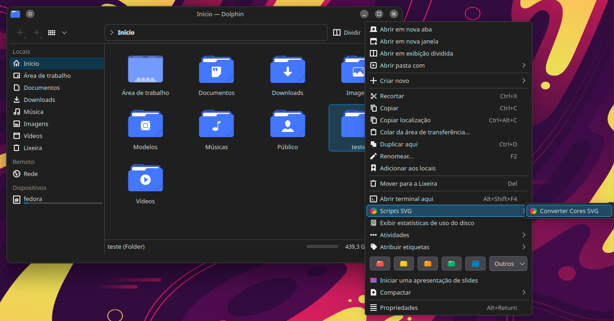
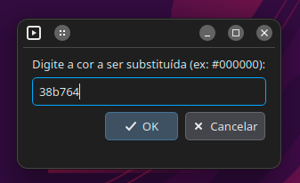
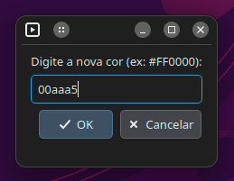
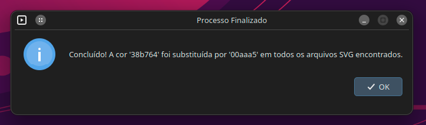

# SVG Color Converter - Service Menu for Dolphin


A Service Menu for the Dolphin file manager (KDE Plasma) that allows you to quickly and interactively replace colors in multiple SVG files.

## About the Project

Working with icon sets or vector files often requires changing a specific color in dozens or hundreds of files. Doing this manually is a tedious and error-prone process.

This tool was created to solve exactly this problem. With a simple integration into Dolphin's context menu, you can right-click any folder and replace one color with another in all the SVG files it contains, using a simple graphical interface.

## Recursos

-   🎨 **Integração Nativa:** Adiciona uma opção "Converter Cores SVG" diretamente ao menu de contexto de pastas no Dolphin.
-   🖥️ **Interface Gráfica:** Utiliza o `kdialog` para solicitar a cor original e a nova cor de forma interativa.
-   ⚙️ **Processamento em Lote:** Altera todos os arquivos `.svg` encontrados dentro de um diretório e seus subdiretórios.
-   🚀 **Instalação Simples:** Acompanha um script `install.sh` que configura tudo automaticamente.
-   🗑️ **Remoção Limpa:** Inclui um script `uninstall.sh` para remover a ferramenta de forma segura.

## Demonstração

O menu de serviço aparece aninhado em "Scripts SVG" no menu de contexto de qualquer pasta:



Ao ser acionado, ele solicita as cores através de caixas de diálogo nativas do sistema:





Uma caixa de dialogo aparece informando que tudo correu bem:



## Pré-requisitos

Para que o script funcione, seu sistema precisa ter:

-   Um ambiente de trabalho **KDE Plasma** com o gerenciador de arquivos **Dolphin**.
-   O pacote `kdialog` (geralmente já vem instalado com o Plasma).
-   `bash`, `find` e `sed` (padrão na maioria das distribuições Linux).

## Instalação

1.  Baixe o arquivo `.tar.gz` do projeto e extraia-o.
2.  Abra um terminal e navegue para dentro da pasta extraída.
    ```bash
    cd svg-coloring-installer
    ```
3.  Execute o script de instalação:
    ```bash
    bash install.sh
    ```
4.  Reinicie o Dolphin para que as alterações tenham efeito:
    ```bash
    dolphin -q && dolphin &
    ```

    ## Como Usar

1.  Abra o Dolphin e navegue até uma pasta que contenha arquivos SVG.
2.  Clique com o botão direito **na pasta**.
3.  Vá até o submenu **Scripts SVG** e clique em **Converter Cores SVG**.
4.  Na primeira janela, digite a cor a ser substituída (ex: `#000000`).
5.  Na segunda janela, digite a nova cor (ex: `#FF0000`).
6.  Aguarde a mensagem de confirmação. Pronto!

## Desinstalação

1.  Navegue novamente até a pasta de instalação.
2.  Execute o script de desinstalação:
    ```bash
    bash uninstall.sh
    ```
3.  Reinicie o Dolphin para que o menu de serviço desapareça.

## Autor

-   **Ney Designer**

---
